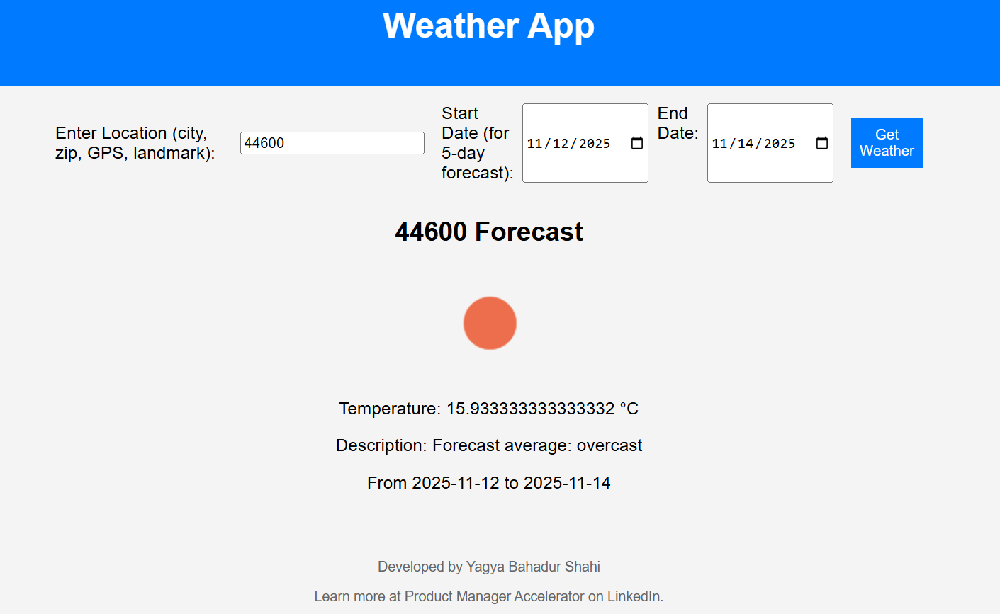
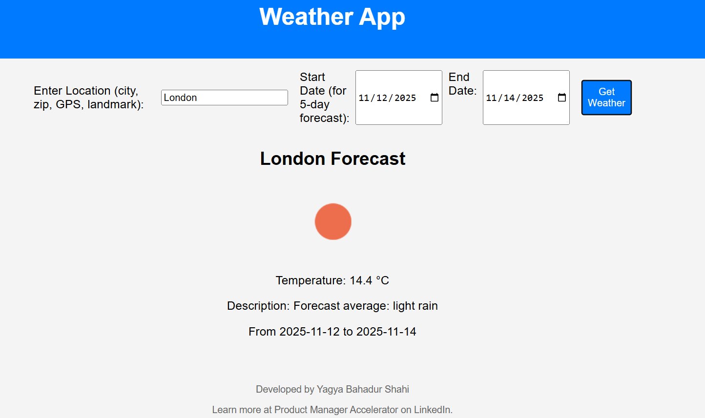
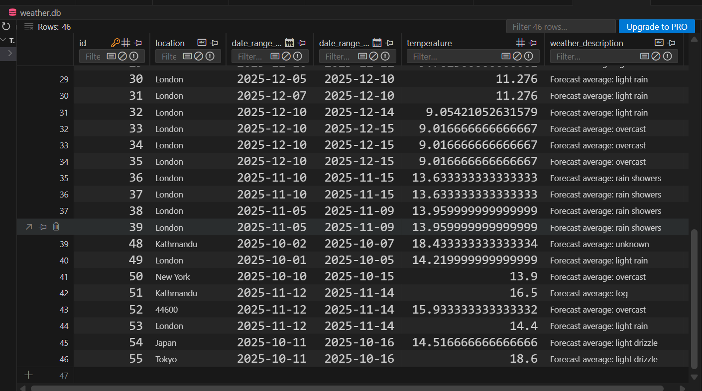

# Weather App Project

## Introduction

Hey there! This is a straightforward Weather App I built for my AI Engineer internship application. The backend is the main star-it's a solid API that pulls real-time weather data from OpenWeatherMap, lets you get current conditions or 5-day forecasts, and stores everything in a local database. There's also a basic frontend to make it user-friendly. I created this to show off my backend skills, like integrating APIs and handling data in Python, without any fake or static info-everything comes straight from live APIs.

I used FastAPI for the backend because it's fast and easy to work with, SQLAlchemy for database stuff (SQLite by default, but it can switch to PostgreSQL), and OpenWeatherMap for the weather data.

## Project Structure

Here's how the files are organized:

```text
weather_app_backend/
├── main.py # The starting point for the FastAPI app
├── db.py # Handles database connections and sessions
├── models.py # Defines the database tables using SQLAlchemy
├── schemas.py # Pydantic models for validating requests and responses
├── routers/
│ └── weather.py # All the API routes for weather operations
├── services/
│ └── weather_service.py # The logic for fetching weather and managing data
├── utils/
│ └── validators.py # Functions to check inputs like dates and locations
├── weather_api.py # Calls to external APIs like OpenWeatherMap
├── .env.example # Template for your environment variables
├── requirements.txt # List of Python packages needed
├── README.md # This file you're reading
└── weather_app_frontend/ # Basic frontend files
    ├── index.html # The main page structure
    ├── style.css # Styles for a nice, responsive look
    └── app.js # JavaScript to connect to the backend and show results
```

## Backend Setup and Instructions

The backend is where most of the magic happens—it's what fetches, validates, and stores the weather data. Let's get it running step by step.

### What You'll Need

- Python (version 3.8 or higher, mine: 3.13.5)
- A tool to create virtual environments (like venv)
- An API key from OpenWeatherMap (grab a free one at https://openweathermap.org/api)

### Setting It Up

1. Clone the repo to your machine:

   ```bash
   git clone <your-repo-url>
   cd weather_app_backend
   ```

2. Set up a virtual environment to keep things clean:

   ```bash
   python -m venv venv
   source venv/bin/activate # On Windows, use venv\Scripts\activate
   ```

3. Install the packages:

   ```bash
   pip install -r requirements.txt
   ```

4. Create your .env file for secrets:

   ```bash
   cp .env.example .env
   ```

   Open .env and add your OpenWeatherMap key (and any other optional ones).

### Setting Up the Database

We're using SQLite to start, but you can switch to PostgreSQL if you want. To create the tables:

1. Run Python:

```bash
python
```

2.Then type:

```python
>>> from models import Base
>>> from db import engine
>>> Base.metadata.create_all(bind=engine)
```

Hit exit() to quit. This makes a file called weather.db with your tables.

### Starting the Server

Fire it up with:

```bash
uvicorn main:app --reload
```

Now the API is live at http://127.0.0.1:8000.

### Checking the API Docs

Head to http://127.0.0.1:8000/docs for the Swagger UI. It's interactive, so you can test things like posting a location to get weather or exporting data right there.

## Backend Features

Here's what the backend can do:

- Pulls live weather from OpenWeatherMap—no fakes here.
- Handles CRUD: Create new weather records (fetch and save), read them (all or one), update with validation (even re-fetches if dates change), and delete.
- Validates everything: Locations checked via API (fuzzy matching for cities, zips, GPS, landmarks), dates for ranges and limits.
- Clean setup with separate folders for routes, services, utils, and API calls—easy to follow and expand.
- Optional extras like exporting data in JSON, CSV, PDF, XML, or Markdown.

## Frontend Quick Guide

The frontend is basic but gets the job done-it's just HTML, CSS, and JS to let you input a location (or dates for forecasts) and see the results with icons.

The files are simple: index.html for the layout, style.css for responsive design (works on phones, tablets, desktops), and app.js to call the backend API and show the info.

It connects by sending POST requests to /weather with your input, then displays the temperature, description, and icon.

To run it: The backend serves it at http://127.0.0.1:8000, or you can open index.html in your browser.

## Environment Variables

Your .env file keeps things secure. Here's what it looks like:

```text
OPENWEATHER_API_KEY=your_key_here
DATABASE_URL=sqlite:///./weather.db # Switch to PostgreSQL if needed
```

- The API key is must-have for weather data.
- Database URL defaults to local SQLite.

## Technologies Used

- Python: The backbone.
- FastAPI: For the API-super efficient.
- Uvicorn: Runs the server.
- SQLAlchemy: Manages the database.
- HTML/CSS/JS: For the frontend.
- OpenWeatherMap API: Current weather and validation.
- Open-Meteo API: For forecasts with historical support.

## Screenshots

### Weather Forecast via Zipcode



### Weather Forecast via location _ London



### weather_database



## Future Improvements

- Throw in some user authentication for security.
- Jazz up the frontend with something like React.
- Deploy it online (maybe on Heroku or AWS).
- Add caching to speed up repeated API calls.

## License

Permission is hereby granted, free of charge, to any person obtaining a copy of this software and associated documentation files (the "Software"), to deal in the Software without restriction, including without limitation the rights to use, copy, modify, merge, publish, distribute, sublicense, and/or sell copies of the Software, and to permit persons to whom the Software is furnished to do so, subject to the following conditions:
